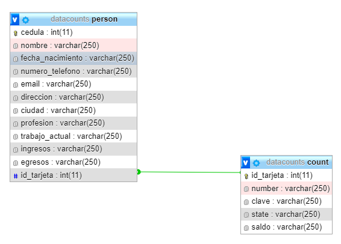

# Backend Java Spring Boot Location 

> Diseño de la base de datos con MySQL

> Docker compose con Mysql

Para crear la base de datos se tiene el archivo docker-compose.yml y la base de datos *data locations.sql*, estos archivos se encuentran en este mismo repositorio. Son los siguientes:

Los pasos para la creación de la bd son los siguientes:

1. Cambiar el path donde se encuentra ubicado el  *data locations.sql* en el archivo docker-compose.yml

2. En la consola de comando se ejecuta lo siguientes comando:
> 

## Nota: Ya con las anteriores configuraciones se puede levanta el proyeto en Spring Boot.

> Inicar el proyecto Spring Boot Tool suite

clonar proyecto y ejecutar con Spring tool suite

En una consola de comandos e instalado Docker Compose se ejecuta lo siguiente:

> See documentation with Swagger

Para ver la documentación del Beackend ingresar a la siguient url= *http://localhost:8080/swagger-ui/index.html*. En la siguiente figura puede ver la respuesta:

